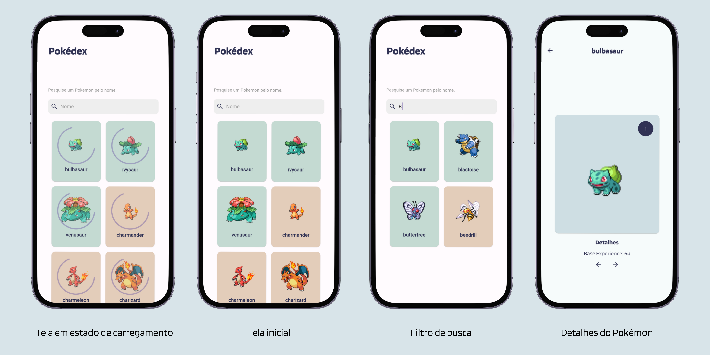

# PokéDex construído com Flutter

Esse projeto tem foco no uso de MobX para gerenciamento de estado, consumo de API com grande fluxo de dados, tratamento de erros e o melhor de tudo: Pokémons!

Aqui foi utilizada a API pública de Pokémon (https://pokeapi.co/) para consulta dos dados, além dos seguintes packages para dar alma ao projeto: Dio para as requisições, MobX para o gerenciamento de estado e cached_network_image para exibição das imagens dos Pokémons - além de dedicação e carinho, claro.

## Instruções para rodar o projeto na sua máquina

Você pode rodar o projeto na sua IDE preferida, mas nesse caso, eu recomendo o uso do Android Studio para visualização multi-device do aplicativo. 

Supondo que você clonou o projeto do GitHub, basta abri-lo na IDE e rodar o seguinte comando no terminal: _flutter pub get_ para pegar todas as dependências. Depois, você seleciona o seu emulador de preferência, pode ser tanto um emulador de dispositivos iOS, quanto Android e até mesmo uma página da Web (Google Chrome). Você vai pressionar a opção de _Debugar_ e voilà, só esperar o projeto carregar. Aqui, segue uma documentação/artigo sobre como emular projetos Flutter no Android Studio: [como configurar um emulador (dispositivo)](https://www.treinaweb.com.br/blog/configurando-ambiente-de-desenvolvimento-flutter) e [como rodar](https://www.treinaweb.com.br/blog/criando-primeiro-projeto-flutter)!

## Como o projeto deve parecer?

## Considerações finais

Pra mim é cada dia mais gratificante estar me desenvolvendo constantemente e, também, colocando meus conhecimentos em prática! Sempre tive a oportunidade de colocar minha criatividade à risca nos projetos e sempre que surge algo novo a ser feito, é uma animação sem fim.

Afinal, esse é o segredo: dedicar-se sem medo para colher, no presente ou no futuro, conhecimento e o poder de compartilhar o que sabemos.
